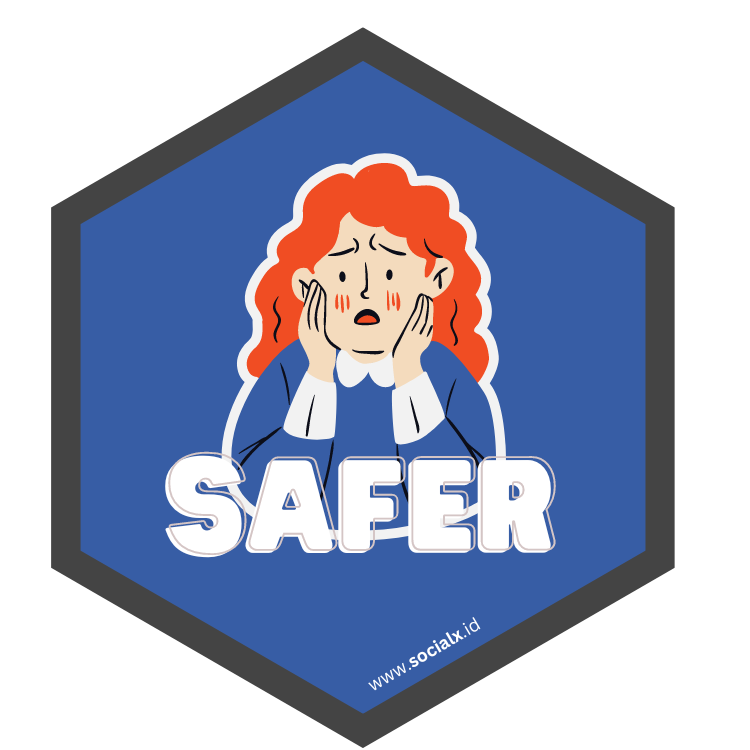

<!-- README.md is generated from README.Rmd. Please edit that file -->

# safer <a href="https://dplyr.tidyverse.org"></a>

<!-- badges: start -->
<!-- badges: end -->

The goal of safer is to help run long analytical processes safely.
Imagine we are running an analysis process that takes several hours and
then a crash occurs, or other conditions that require us to run the
entire analysis process from the start. Don’t worry, this is safer.

## Installation

You can install the development version of safer from
[GitHub](https://github.com/) with:

``` r
# install.packages("devtools")
devtools::install_github("socialx-analytics/safer")
```
